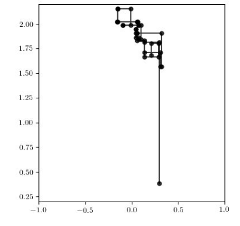

# GenSMC.jl

Advanced Sequential Monte Carlo and annealed importance sampling inference library for Gen

## API

### Sampling importance resampling as a generative function

(e.g. for use as part of an MH proposal)

- `selection_sir_gf`

### Selection-based MCMC moves using sampling importance resampling

- `selection_sir_mh`

- `sir_pgibbs`

### Annealed importance sampling

- `ais`

- `ais_gf`

### Selection-based MCMC moves using annealed importance sampling

- `selection_ais_mh`

## Tutorial on AIS

Suppose we want to estimate marginal likelihoods in the model `foo` below:
```julia
p_true_given_true(theta) = 0.5 + 0.4 * theta # theta ranges from 0 to 1

@gen function foo(theta::Float64)
    z = @trace(bernoulli(0.2), :z)
    p = p_true_given_true(theta)
    x = @trace(bernoulli(z ? p : 1-p), :x)
end
```
Specifically, we want to compute the marginal probability that `x = true`, given `theta=1.`, using AIS or [annealed importance sampling](https://arxiv.org/abs/physics/9803008).
We first construct a sequence of arguments that interpolates between a version of the model in which ancestral sampling approximates the posterior (`theta=0.`) and the version of the model that we care about (`theta=1.`).
We use `10^5` steps:
```julia
args_seq = map((theta) -> (theta,), range(0., stop=1., length=Int(1e5)))
```
We also indicate which of the arguments is changing (in this case there is only one argument):
```julia
argdiffs = (UnknownChange(),)
```
Next, we define the MCMC kernels that are going to be used during annealing.
This is a function that takes a trace of the model and returns a new trace.
It should satisfy detailed balance with respect to the target distributoin implied by the argumnets to the current trace and the values of the constrained random choices.
Kernels built with `Gen.mh` satisfy this property:
```
mh_kernel = t -> mh(t, select(:z))[1]
```
Finally, we run AIS:
```julia
lml_estimate, = GenSMC.ais(foo, choicemap((:x, true)), args_seq, argdiffs, mh_kernel)
```

## Annealed importance sampling as a generative function

We can also wrap AIS inference as a generative function.
This allows us to use it within models and proposal distributions.
We invoke a generative function combinator with no arguments that returns a singleton value for our AIS-based generative function (all the input will be passed in dynamically as arguments to the generative function):
```julia
ais_gf = GenSMC.AISGF()
```

We use the same sequence as above:
```
args_seq = map((theta) -> (theta,), range(0., stop=1., length=Int(1e5)))
argdiffs = (UnknownChange(),)
```
However, now, we also need to pass in a *reverse* MCMC kernel alongside the forward MCMC kernel.
For forward kernels that satisfy detailed balance, the reverse kernel is the same as the forward kernel.
For forward kernels that are cycles (e.g. sequences) of application of detailed balance kernels, the revere kernel simply applies the same sequence in reverse.
In our case, the two kernels are the same:
```julia
mh_fwd, mh_rev = t -> mh(t, select(:z))[1], t -> mh(t, select(:z))[1]
```
Finally, we also need to provide a selection of which addresses we are exposing as part of the address space of the AIS generative function.
In this case, we are exposing the latent varible `z`: (TODO explain this better)
```julia
output_addrs = select(:z)
```

We then use our generative function:
```julia
ais_trace = Gen.simulate(AISGF(), (
    foo, choicemap((:x, true)), args_seq, argdiffs, mh_fwd, mh_rev, output_addrs)
```

Note that all the intermediate random choices made during annealing are treated as *non-addressable randomness*.

We can then use `make_ais_mh_move` (currently undocumented) to do MCMC, where we use AIS as the basis of a proposal distribution.
As the number of annealing steps increases, the proposal distribution approaches the conditional distribution on the selected choices (i.e. we approach Gibbs sampling):




